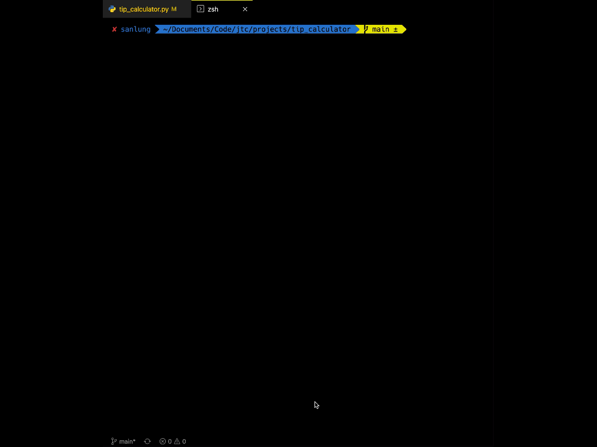

<p align="center"><a href="https://github.com/Sanlung"></a></p>
<h3 align="center">Tip Calculator</h3>
<!-- <h4 align="center">By Chung Kao</h4> -->
<p align="center">First Project of the Justice Through Code, Spring 2022 Cohort</p>
<p align="center"></p>

 

## About

This project is completed as part of the curriculum for the [Justice Through Code's](https://centerforjustice.columbia.edu/justicethroughcode) Spring 2022 cohort. Justice Through Code is a free full stack web development intensive that provides opportunities for formerly incarcerated individuals to become leaders in tech. It is jointly ​offered by Columbia University’s Center for Justice, and the Tamer Center for Social Enterprise at Columbia Business School

### Usage

This simple calculator requires only that you have [Python3](https://www.python.org/downloads/) installed to run it. To get started simply clone a copy of this repo to your local environment:

```
$ git clone https://github.com/Sanlung/tip-calculator-jtc2022.git
```

or

```
$ git clone git@github.com:Sanlung/tip-calculator-jtc2022.git
```

Just run the Python script to use the calculator in the command line:

```
$ cd tip-calculator-jtc2022
$ python3 tip_calculator.py
```

And you have:



Please feel free to add more features to the calculator.

### License


- MIT License
